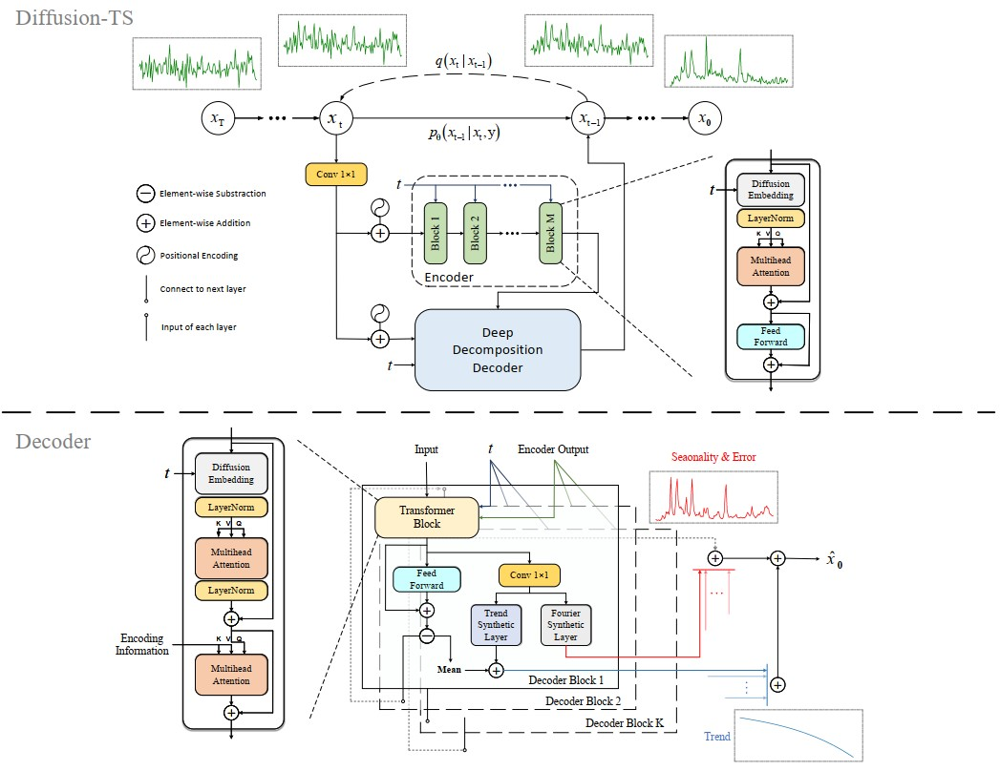
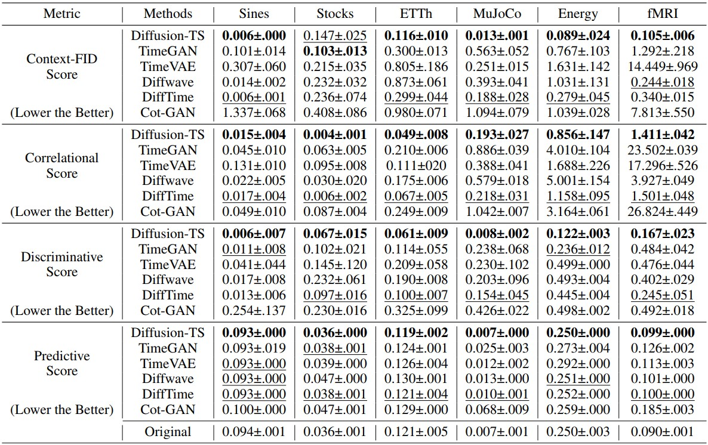
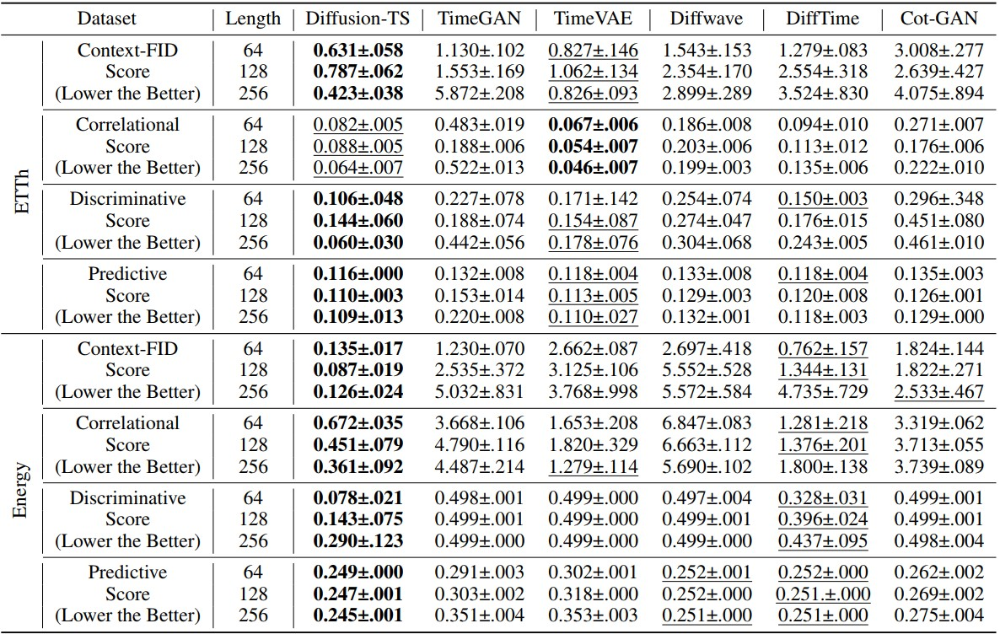
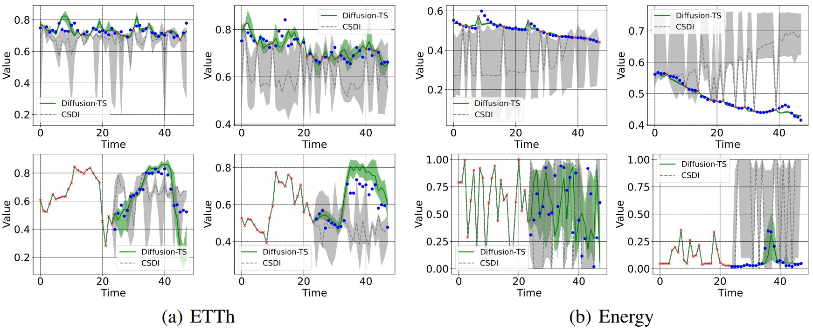

# Diffusion-TS: Interpretable Diffusion for General Time Series Generation

[](https://github.com/Y-debug-sys/Diffusion-TS/stargazers)
[](https://github.com/Y-debug-sys/Diffusion-TS/network) 
[](https://github.com/Y-debug-sys/Diffusion-TS/blob/main/LICENSE) 


> **Abstract:** Denoising diffusion probabilistic models (DDPMs) are becoming the leading paradigm for generative models. It has recently shown breakthroughs in audio synthesis, time series imputation and forecasting. In this paper, we propose Diffusion-TS, a novel diffusion-based framework that generates multivariate time series samples of high quality by using an encoder-decoder transformer with disentangled temporal representations, in which the decomposition technique guides Diffusion-TS to capture the semantic meaning of time series while transformers mine detailed sequential information from the noisy model input. Different from existing diffusion-based approaches, we train the model to directly reconstruct the sample instead of the noise in each diffusion step, combining a Fourier-based loss term. Diffusion-TS is expected to generate time series satisfying both interpretablity and realness. In addition, it is shown that the proposed Diffusion-TS can be easily extended to conditional generation tasks, such as forecasting and imputation, without any model changes. This also motivates us to further explore the performance of Diffusion-TS under irregular settings. Finally, through qualitative and quantitative experiments, results show that Diffusion-TS achieves the state-of-the-art results on various realistic analyses of time series. 

Diffusion-TS is a diffusion-based framework that generates general time series samples both conditionally and unconditionally. As shown in Figure 1, the framework contains two parts: a sequence encoder and an interpretable decoder which decomposes the time series into seasonal part and trend part. The trend part contains the polynomial regressor and extracted mean of each block output. For seasonal part, we reuse trigonometric representations based on Fourier series. Regarding training, sampling and more details, please refer to [our paper](https://openreview.net/pdf?id=4h1apFjO99) in ICLR 2024. 

<p align="center">
  
  <br>
  <b>Figure 1</b>: Overall Architecture of Diffusion-TS.
</p>


## Dataset Preparation

All the four real-world datasets (Stocks, ETTh1, Energy and fMRI) can be obtained from [Google Drive](https://drive.google.com/file/d/11DI22zKWtHjXMnNGPWNUbyGz-JiEtZy6/view?usp=sharing). Please download **dataset.zip**, then unzip and copy it to the folder `./Data` in our repository.


## Running the Code

 The code requires conda3 (or miniconda3), and one CUDA capable GPU. The instructions below guide you regarding running the codes in this repository. 

### Environment & Libraries

The full libraries list is provided as a `requirements.txt` in this repo. Please create a virtual environment with `conda` or `venv` and run

~~~bash
(myenv) $ pip install -r requirements.txt
~~~

### Training & Sampling

For training, you can reproduce the experimental results of all benchmarks by runing

~~~bash
(myenv) $ python main.py --name {name} --config_file {config.yaml} --gpu 0 --train
~~~

**Note:** We also provided the corresponding `.yml` files (only stocks, sines, mujoco, etth, energy and fmri) under the folder `./Config` where all possible option can be altered. You may need to change some parameters in the model for different scenarios. For example, we use the whole data to train model for unconditional evaluation, then *training_ratio* is set to 1 by default. As for conditional generation, we need to divide data set thus it should be changed to a value < 1. 

While training, the script will save check points to the *results* folder after a fixed number of epochs. Once trained, please use the saved model for sampling by running

#### Unconstrained
```bash
(myenv) $ python main.py --name {name} --config_file {config.yaml} --gpu 0 --sample 0 --milestone {checkpoint_number}
```

#### Imputation
```bash
(myenv) $ python main.py --name {name} --config_file {config.yaml} --gpu 0 --sample 1 --milestone {checkpoint_number} --mode infill --missing_ratio {missing_ratio}
```

#### Forecasting
```bash
(myenv) $ python main.py --name {dataset_name} --config_file {config.yaml} --gpu 0 --sample 1 --milestone {checkpoint_number} --mode predict --pred_len {pred_len}
```


## Visualization and Evaluation

After sampling, synthetic data and orginal data are stored in `.npy` file format under the *output* folder, which can be directly read to calculate quantitative metrics such as discriminative, predictive, correlational and context-FID score. You can also reproduce the visualization results using t-SNE or kernel plotting, and all of these evaluational codes can be found in the folder `./Utils`. Please refer to `.ipynb` tutorial files in this repo for more detailed implementations.

**Note:** All the metrics can be found in the `./Experiments` folder. Additionally, by default, for datasets other than the Sine dataset (because it do not need normalization), their normalized forms are saved in `{...}_norm_truth.npy`. Therefore, when you run the Jupternotebook for dataset other than Sine, just uncomment and rewrite the corresponding code written at the beginning.

### Main Results

#### Standard TS Generation
<p align="center">
  <b>Table 1</b>: Results of 24-length Time-series Generation.
  <br>
  
</p>

#### Long-term TS Generation
<p align="center">
  <b>Table 2</b>: Results of Long-term Time-series Generation.
  <br>
  
</p>

#### Conditional TS Generation
<p align="center">
  
  <br>
  <b>Figure 2</b>: Visualizations of Time-series Imputation and Forecasting.
</p>


## Authors

* Paper Authors : Xinyu Yuan, Yan Qiao

* Code Author : Xinyu Yuan

* Contact : yxy5315@gmail.com


## Citation
If you find this repo useful, please cite our paper via
```bibtex
@article{yuan2024diffusion,
  title={Diffusion-TS: Interpretable Diffusion for General Time Series Generation},
  author={Yuan, Xinyu and Qiao, Yan},
  journal={arXiv preprint arXiv:2403.01742},
  year={2024}
}
```


## Acknowledgement

We appreciate the following github repos a lot for their valuable code base:

https://github.com/lucidrains/denoising-diffusion-pytorch

https://github.com/cientgu/VQ-Diffusion

https://github.com/XiangLi1999/Diffusion-LM

https://github.com/philipperemy/n-beats

https://github.com/salesforce/ETSformer

https://github.com/ermongroup/CSDI

https://github.com/jsyoon0823/TimeGAN
